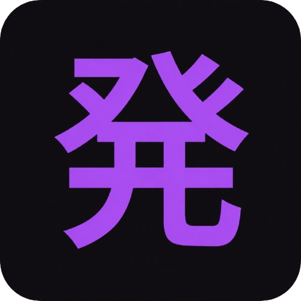

  

  # Hakkutsu (発掘)
  **AI Japanese Immersion & Mining Tool for Chrome**

Hakkutsu (発掘) is a fast, privacy-first browser extension designed for Japanese immersion, reading comprehension, and sentence mining. It runs directly in your browser, analyzing Japanese text from web pages, breaking down grammar, providing furigana readings, and syncing vocabulary to Anki.
---

## Key Features

- **Smart Inline Dictionary & Parser**: Instant morphological analysis with Sudachi and Kuromoji tokenizers. Displays pitch accents, furigana, JLPT levels (N5 to N1), and Sino-Vietnamese (Hán-Việt) readings.
- **AI Grammar & Sentence Breakdown**: Connect your own Gemini or OpenAI API key for contextual translations, idiom explanations, and sentence structure breakdown.
- **AnkiConnect Sync**: One-click flashcard export directly to your local Anki deck via AnkiConnect (`http://localhost:8765`), including words, readings, audio, definitions, and sentence context.
- **Built-in SRS Dashboard**: Review saved vocabulary anytime using the local Spaced Repetition System dashboard built directly into the extension.
- **Flexible Lookup Triggers**: Choose your preferred lookup mode in settings: text selection highlight, double-click, or `Alt + Hover` over Japanese words.

---

## Installation Guide

1. Download the production extension build package `chrome-mv3-prod.zip` from `build/`.
2. Open your browser and navigate to `chrome://extensions`.
3. Enable **Developer mode** using the toggle switch in the upper right corner.
4. Drag and drop the `chrome-mv3-prod.zip` file onto the extensions page (*"Drop a ZIP or CRX file here or select a file"*), or click **Load unpacked** and choose `build/chrome-mv3-prod`.

---

## Support the Project

If you find Hakkutsu helpful for learning Japanese, consider supporting development on Ko-fi:

[Support on Ko-fi (ko-fi.com/joshiminh)](https://ko-fi.com/joshiminh)
