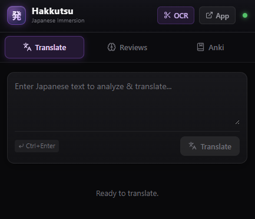
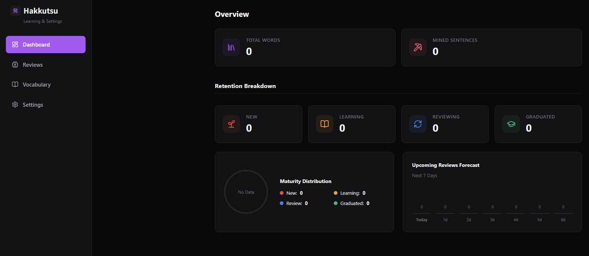
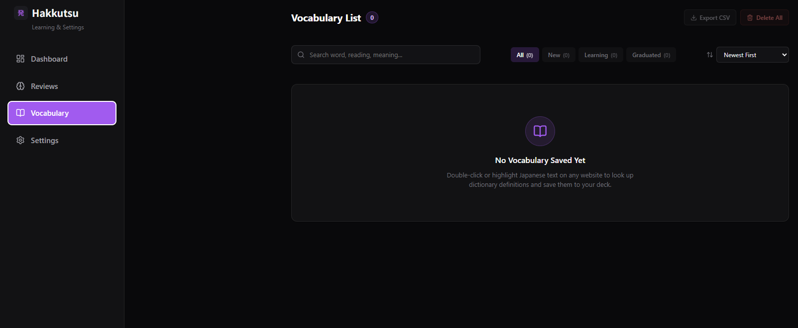
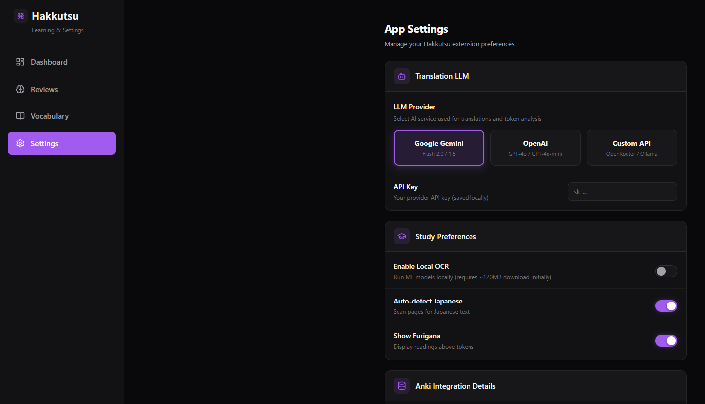

<div align="center">
  

  # Hakkutsu (発掘)
  **AI Japanese Immersion & Mining Tool**
</div>

Hakkutsu is an AI-powered browser extension designed for Japanese immersion and translation. It runs directly in your browser, extracting Japanese text from images, translating sentences, analyzing grammar, and helping you learn vocabulary as you browse the web.

## Screenshots

| Extension Popup | Dashboard Overview |
|:---:|:---:|
|  |  |
| **Vocabulary List** | **App Settings** |
|  |  |

## Core Features

- **Local OCR**: Crop images or manga on webpages to extract Japanese text using ONNX Manga-OCR (powered by Transformers.js) directly in the browser.
- **AI Translation & Grammar Analysis**: Get translations (mainly Japanese to Vietnamese) and token-by-token grammar explanations using Gemini, OpenAI, or custom LLM API endpoints.
- **YouTube Subtitle Translation**: Fetch and translate YouTube caption tracks on the fly.
- **Sino-Vietnamese (Han-Viet) readings**: Automatically shows Sino-Vietnamese readings for Japanese terms.
- **Anki & SRS Integration**: Export vocabulary directly to Anki via AnkiConnect or review them using the built-in local Spaced Repetition System.

## Configuration

Hakkutsu runs locally inside the browser and connects directly to AI providers without a backend server. Configure your API keys in the extension options page:

- **LLM Provider**: Choose between Gemini (recommended), OpenAI, or a custom API endpoint.
- **API Key**: Enter your API key for the selected provider.
- **Model**: Custom model configurations can be set up in options.

## Development

The project is built using React, TypeScript, and Plasmo.

### Prerequisites

Ensure you have Node.js and pnpm installed.

### Setup and Running

1. Install dependencies:
   ```bash
   pnpm install
   ```

2. Start the development server:
   ```bash
   pnpm dev
   ```

3. Load the extension in Chrome:
   - Navigate to `chrome://extensions/`.
   - Enable **Developer Mode** in the top-right corner.
   - Click **Load unpacked**.
   - Select the build directory: `extension/build/chrome-mv3-dev`.

### Production Build

To build the extension for production:
```bash
pnpm build
```

## Third-Party Notices

Hakkutsu includes original code informed by the following MIT-licensed projects:

### asbplayer
- Repository: https://github.com/asbplayer/asbplayer
- Revision: `a123006997654fc44f604418ee5d2e3ac0cbb504`
- Used for: Retrieving runtime YouTube caption track URLs from the player, including runtime-only proof-of-origin parameters.

### SubtideX
- Repository: https://github.com/yniijia/SubtideX
- Revision: `8738fa47fdc742477e3d59766b222509062e49ca`
- Used for: The transcript panel fallback strategy and compatibility selectors for current YouTube transcript renderers.

## License

This project is unlicensed (private). See the LICENSE file for details.