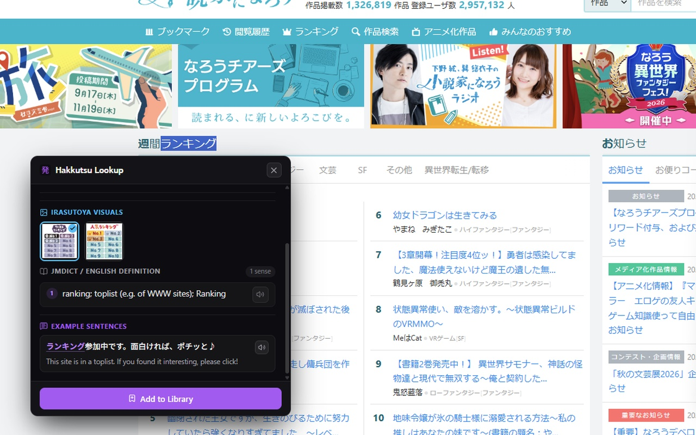
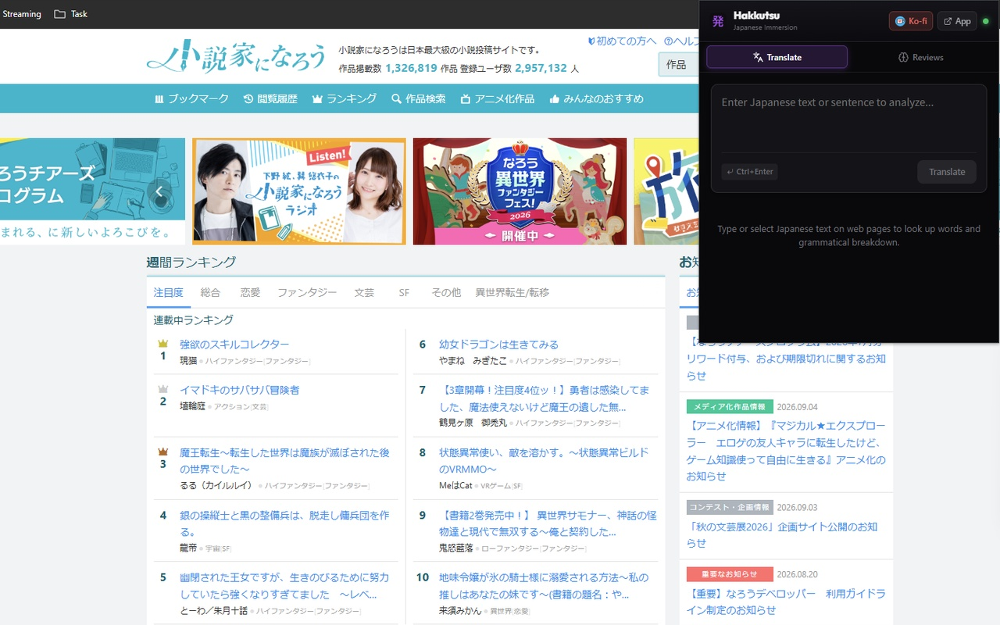
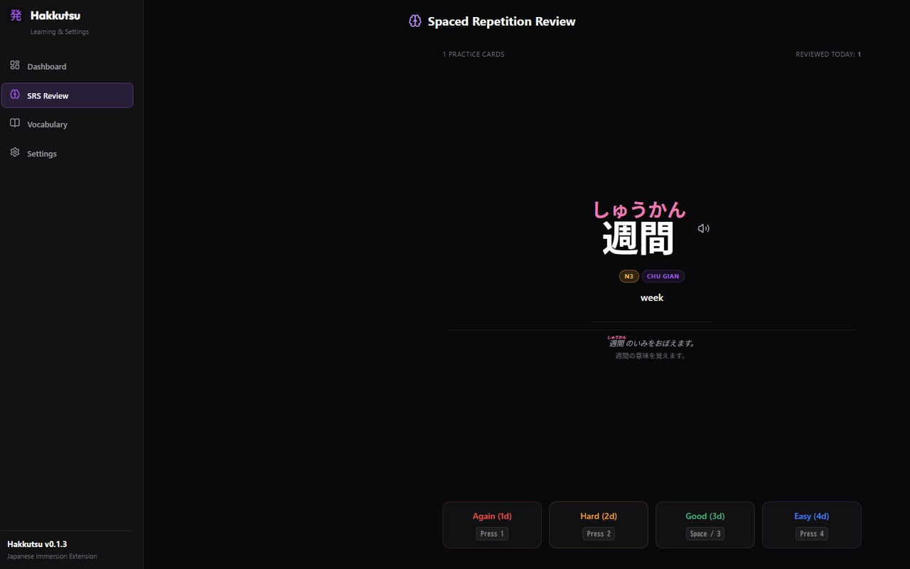
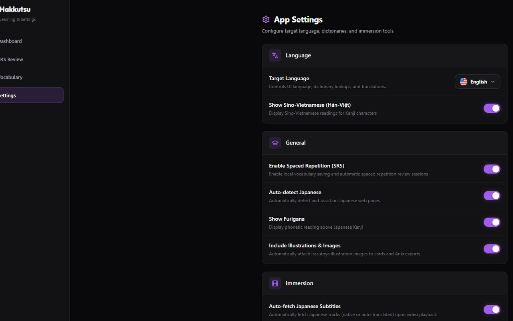

  

  # Hakkutsu (発掘)
  **Local-First Japanese Immersion & Sentence Mining Extension for Chrome**

  [Add to Chrome Web Store](https://chromewebstore.google.com) • [Support on Ko-fi](https://ko-fi.com/joshiminh) • [Privacy Policy](privacy.html)

---

## Overview

Hakkutsu (meaning "excavation" or "discovery") is a free, local-first browser extension designed for Japanese language learners. It brings dictionary lookups, furigana readings, pitch accent indicators, SRS reviews, and sentence mining directly into the web pages and videos you visit.

Whether reading news articles, light novels, social media posts, or watching video content on YouTube and Netflix, Hakkutsu helps you understand unfamiliar vocabulary on the spot and save it for long-term retention.

---

## Key Features

- **Instant Offline Lookup**: Hover or select Japanese text on any web page to display definitions, pitch accent graphs, furigana readings, and JLPT difficulty badges.
- **1-Click AnkiConnect Mining**: Export target vocabulary, example sentences, audio pronunciation, and contextual definitions directly to your local Anki desktop software.
- **Video Subtitle Immersion**: Study with interactive dual subtitles on YouTube, Netflix, third-party sites, and custom HTML5 video players with hover-to-pause definitions.
- **Built-in SRS & Visualizations**: Review saved vocabulary using the built-in Spaced Repetition System. Track learning progress with charts, review analytics, and kanji stroke order diagrams.
- **100% Local & Privacy-First**: Operates completely offline on your device with zero telemetry, zero analytics, no external servers, no account required, and zero data tracking.
- **Completely Free**: No subscriptions, no payment required, no paywalls, and no ads.

---

## Extension Screenshots

### 1. Instant Dictionary Lookup & Pitch Accent
Look up Japanese words directly inside web pages with furigana, pitch accent graphs, and part-of-speech labels.

### 2. Extension Quick Lookup Popup
Access quick translation, dictionary lookups, study streaks, and mined word metrics directly from the extension popup.

### 3. Video Subtitle Immersion & Dual Subtitles
Study Japanese media on YouTube, Netflix, and custom HTML5 video players with interactive dual subtitles and click-to-pause lookups.

### 4. Built-in Spaced Repetition System (SRS)
Review saved vocabulary on schedule with built-in spaced repetition card reviews directly inside the extension dashboard.

### 5. Customization & AnkiConnect Settings
Configure lookup keyboard shortcuts, dictionary preferences, and 1-click Anki desktop synchronization.

---

## Installation

1. Install the extension from the official [Chrome Web Store](https://chromewebstore.google.com).
2. Pin the Hakkutsu icon to your browser toolbar.
3. Click the toolbar icon to configure your preferred lookup shortcuts (e.g. Highlight, Double-Click, or Alt + Hover).
4. If using Anki, ensure your Anki desktop application is running with the AnkiConnect add-on enabled.

---

## Learning Hub Dashboard

Open the full-screen Learning Hub from the extension options or popup menu:

| Section | Description |
| :--- | :--- |
| **Dashboard** | View daily learning statistics, study streaks, and mined vocabulary totals. |
| **SRS Review** | Perform interactive spaced repetition card reviews. |
| **Vocabulary** | Search, filter, edit, and organize your saved word library. |
| **Settings** | Configure lookup shortcuts, language preferences, and Anki card templates. |

---

## Privacy Policy

Hakkutsu is built privacy-first:
- All text processing and dictionary lookups take place 100% locally on your machine.
- User settings and saved vocabulary items are stored exclusively on your device.
- Anki synchronization connects directly to your local Anki desktop software (`http://localhost:8765`).
- No personal data, browsing history, or metrics are ever collected or transmitted.

Read the full [Privacy Policy](privacy.html) for detailed disclosures.

---

## Support & Feedback

If Hakkutsu helps you enjoy reading and learning Japanese, consider supporting ongoing open-source development:

- **Support on Ko-fi**: [ko-fi.com/joshiminh](https://ko-fi.com/joshiminh)

---

## License

Distributed under the MIT License. See `LICENSE` for more information.
