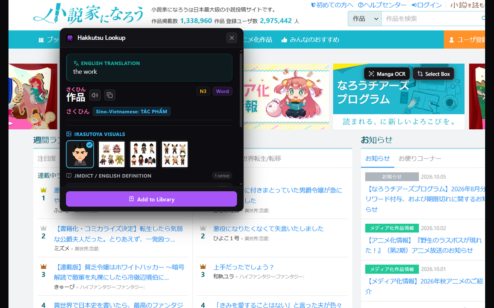
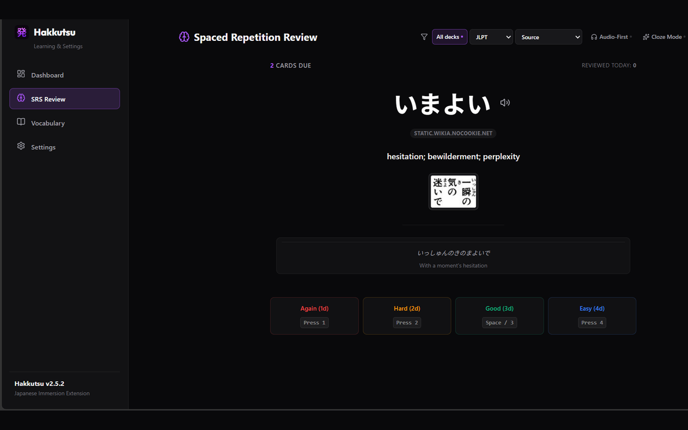

<div align="center">
  
  <h1>Hakkutsu <span lang="ja">発掘</span></h1>
  <p>Local-first Japanese immersion extension. Read, watch, mine, and review without leaving the page.</p>

  [Website](https://joshiminh.github.io/Hakkutsu/) · [Privacy](privacy.html) · [Ko-fi](https://ko-fi.com/joshiminh)
</div>

---



Hakkutsu is a browser extension for Japanese immersion. It brings inline dictionary lookup, interactive video subtitles, manga OCR, sentence mining, AnkiConnect export, and built-in spaced repetition into one local-first workflow.

**Inline lookup** — select or hover over Japanese text to see readings, definitions, JLPT level, pitch accent, kanji stroke order, and audio.

**Video subtitles** — dual-subtitle overlays for YouTube, Netflix, and compatible HTML5 players. Hover any word to inspect it; a side-panel transcript lets you follow and search by line.

**Manga OCR** — click speech bubbles to trigger on-device Tesseract LSTM recognition and look up text without typing.

**Sentence mining** — save word, sentence, source, screenshot, and tags as a vocabulary card in one click.

**Spaced repetition** — FSRS-4.5/5 scheduling with Audio-First and Cloze Deletion review modes. Smart deck filters by JLPT level, source, due status, and leech flags.

**AnkiConnect** — export cards to a local Anki deck with configurable field mappings.

**Portable data** — CSV export or full JSON backup/restore with SRS state preserved.

**8-language UI** — English, Vietnamese, Japanese, Chinese, Korean, Spanish, French, Indonesian.

---



## Privacy

All data stays on-device — IndexedDB and `chrome.storage`. No account, no analytics, no remote backend. AnkiConnect and any local translation server are only contacted on user action. Use **Vocabulary → Backup** before uninstalling or clearing browser data.

## Browser support

| Target | Build |
| --- | --- |
| Chromium | Manifest V3 |
| Firefox | Manifest V2 |

## Development

Requires Node.js 18+ and pnpm 8+.

```bash
pnpm install
pnpm dev
```

| Command | Purpose |
| --- | --- |
| `pnpm dev` | Dev server with HMR |
| `pnpm typecheck` | TypeScript validation |
| `pnpm build` | Chrome MV3 → `.output/chrome-mv3` |
| `pnpm build:firefox` | Firefox MV2 → `.output/firefox-mv2` |
| `pnpm zip` | Store-ready archive |

**Load unpacked (Chrome):** `pnpm build` → `chrome://extensions` → Developer mode → Load unpacked → `.output/chrome-mv3`.

**Load unpacked (Firefox):** `pnpm build:firefox` → `about:debugging` → Load Temporary Add-on → `.output/firefox-mv2/manifest.json`.

## Releases

Creating a GitHub Release builds and attaches Chrome and Firefox ZIPs. Store publishing (Chrome Web Store, Firefox AMO) runs automatically when the relevant repository secrets are configured. Release assets are always created regardless.

## Contributing

Run `pnpm typecheck`, `pnpm build`, and `pnpm build:firefox` before submitting a pull request.

## License

[MIT](LICENSE) © Hakkutsu contributors.
